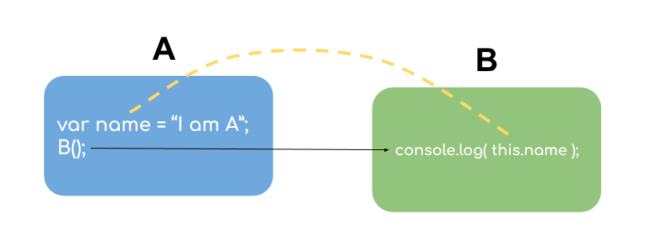

<div dir="rtl">


<div style="text-align:center;">

<h1> بسم الله الرحمن الرحيم </h1>

</div>

# مقدمة عن `this` وحقيقة ما نجهله عنها


سنتناول في هذا الكتاب الحديث عن الكلمة المُمَيزّة `this` وعن طريقة (أو طرق) ترتيب النصوص البرمجية وفق ما يسمى بالبرمجة غرضية التوجه وكشف حقيقة تطبيقها في لغة JS والبديل الأفضل منها.

بداية سنخصص وقت لا بأس به لفهم الكلمة الخاصة `this` المستخدمة في لغة JS لأن فهمنا لها سيساهم في فهم جزء كبير من هذا الكتاب, بل أنا أزعم أن فهمها سيساعد بشكل كبير على فهم ما يقارب ثلث اللغة, فلغة JS ترتكز على ثلاث ركائز أساسية إحداها هو الكلمة المفتاحية `this` و `prototype`.


## ما هي `this` ؟

هي كلمة محجوزة مُمَيّزة معرّفة بشكل ضمني(أتوماتيكي) داخل كل تابع, تشير دائما الى غرض ما, يتم تحديد هذا الغرض بشكل كامل في لحظة استدعاء التابع ولا يعتمد أبداً على مكان أو طريقة تعريف التابع.

ستأتي الأسطر التالية لتفسر كل كلمة من هذا التعريف وسأعيد كتابته لربط كل الافكار معا.

في اللغة ستجد كلمات محجوزة مثل 

for لتعريف الحلقات

function  لتعريف التوابع

return لإعادة قيمة ضمن تابع 


وهكذا…

وكذلك الكلمة `this` محجوزة في اللغة لذلك لا يمكن استعمالها كاسم لمتغير ما (سواءً كان الاسم للمتغير معرّف خارج أو داخل أي تابع)


<div dir="ltr">

```js
var this = 3; //Uncaught SyntaxError: Unexpected token 'this'
```

</div>


<div dir="ltr">

```js
function someFunction(){ this = 4; } //Uncaught SyntaxError: Invalid left-hand side in assignment
```

</div>

مُمَيّزَة لأن قيمتها (أو ما تشير اليه حقيقة) يختلف (ولو كنت تستخدم التابع ذاته) بحسب طريقة الاستدعاء للتابع.

معرّفة بشكل ضمني (أتوماتيكي) داخل كل تابع…

## تذكير

### ما هو التابع؟

 هو عملية رياضية تتلقى دخلا ما وتعيد خرجا ما, ولكن تعريف التابع في البرمجة يختلف عن التعريف الرياضي لأنه في الرياضيات لا يوجد تابع الا وله دخل وخرج, أمّا في البرمجة يمكن للتابع ألّا يأخذ دخل كما يمكن له ألّا يُعيد أي خرج, فالأمر متروك للمبرمج فالبعض يستخدم التوابع كحاوية(للتغليف) تحيط ببعض النصوص البرمجية بهدف عزلها عن بقية النص البرمجي وإعادة استخدامها.

مثال عملي على تعريف التابع

<div dir="ltr">

```js

function sum( a, b ){
	return a + b;
}

sum(3, 4); // 7

```

</div>


الآن لنأتي في حديثنا عن `this` ضمن التوابع, نلاحظ انها كلمة محجوزة يمكنك استخدامها داخل أي تابع كالتالي


<div dir="ltr">

```js

function sayHello() {
	return “Hello “ + this.name;
}

```

</div>

انا لم اقم بتعريف `this` على انها متغير أو غرض ما (يجب التنبيه ان `this` دائما تشير الى غرض لذلك ترى النص الذي يستخدم `this` 
يصل لخصائص ومتغيرات من خلالها كما يتم الوصول لخصائص الغرض تماما) اي انا لم اكتب


<div dir="ltr">

```js
var this = { name: “Ahmad” };
```

</div>

علماً أني لو قمت بهذا لحصلت على خطأ من المترجم(compiler) (نعم!! لغة JS مترجمة) وأنا لم أقم بتمرير `this` للتابع كما يلي

<div dir="ltr">

```js

var this = { name: “Ahmad” }

function sayHello( this ) {
	return “Hello “ + this.name;
}

sayHello(this);

```

</div>

فهي اذا كلمة معرّفة بشكل ضمني (اتوماتيكي) داخل كل تابع (ويمكن كتابة `this` خارج التوابع لكن استخدامها بهذه الطريقة قليل جدا, 
وسنتكلم الى ما تشير إليه لاحقاً إن شاء الله)

ونلاحظ انها دائما تشير الى غرض ما

## تذكير

### ماهو الغرض؟

هو أحد أنماط القيم الموجودة في اللغة(تملك الغة أنماط للقيم ولكن ليس للمتغيرات), مثال على طريقة تعريفه

<div dir="ltr">

```js 

var me = { 
	name: “Louay”
}

```

</div>

فهو يحتفظ بالقيم على شكل مفتاح وقيمة تماما كدليل الهواتف


<div dir="ltr">

```js 

var  phoneBook={
    Ahmad: “0113732714”,
    Louay: “0113224367” 
}

```

</div>

و للوصول لقيمة ما

<div dir="ltr">

```js
phoneBook.Louay; // “0113224367”
```

</div>

أو

<div dir="ltr">

```js
phoneBook[“Louay”]; // “0113224367”
```

</div>

وسنتناول موضوع الأغراض بعمق لاحقا لكن الجدير بالذكر ان `this` تشير الى غرض ما دائما لذلك لا ترى أننا نسخدم `this` لوحدها, بل غالبا ما نريد الوصول لقيمة ما من خلالها, باستخدامها مع اسم إحدى الخصائص الموجودة في هذا الغرض (الذي تشير إليه `this`)

يتم تحديد هذا الغرض الذي تشير إليه هذه الكلمة اعتمادا على كيفية استدعاء هذا التابع

<div dir="ltr">

```js

function sayHello(){
	return “Hello “ + this.name;
}

var me = { name: “Louay” }
var you = { name: “Ahmad” }

sayHello.call( me ); // “Hello Louay”
sayHello.call( you ); // “Hello Ahmad”

```

</div>

نفس التابع `sayHello` أعطى خرجاً مختلفاً بناءً على مكان وكيفية الاستدعاء, قد تتعجب من كيفية الوصول لهذا الخرج ولكن لا تتعب 
نفسك كثيرا في الكيف(لأننا سنشرح ذلك لاحقا) ولكن انظر الى الفائدة من استخدام `this` مع أكثر من سياق لاخراج اكثر من خرج بحسب السياق.

مثال مشابه

<div dir="ltr">

```js

function sayHello(){
    return “Hello “ + this.name;
}

var me = {
	name: “Louay”,
	callMeByName: sayHello
}

var you = {
	name: “Ahmad”,
	callMeByName: sayHello
}

me.callMeByName(); // “Hello Louay”
you.callMeByName(); // “Hello Ahmad”

```

</div>

في كلا الغرضين `me` و `you` لدينا التابع `callMeByName` الذي يشير الى التابع `sayHello` حقيقةً, وعند استدعاء التابع مرتين (كل مرة مع ضمن سياق مختلف) نصل في كل مرة إلى نتيجة مختلفة على الرغم من أنه في المرتين نستخدم نفس التابع.

وبذلك نجد ان `this` تشير الى غرض ما يتم تحديده تماما في لحظة استدعاء التابع ولا علاقة له ابدا بمكان وجود هذا التابع.

سأعيد عليك التعريف لكي تستطيع أن تجمع خيوط التعريف مرة آخرى في ذهنك

`this` كلمة محجوزة مُمَيّزة معرّفة بشكل ضمني(أتوماتيكي) داخل كل تابع, تشير دائما الى غرض ما, يتم تحديد هذا الغرض بشكل كامل في لحظة استدعاء التابع ولا يعتمد أبداً على مكان أو طريقة تعريف التابع.


لماذا سأستخدم `this` على أية حال؟
ببساطة بسبب سهولة اعادة استخدام التابع ضمن سياقات مختلفة
ستسأل: لماذا لا امرر السياق الذي اريد بيدي هكذا

<div dir="ltr">

```js
function sayHello( context ){
    return “Hello “ + context.name;
}

sayHello(me); // “Hello Louay”
sayHello(you); // “Hello Ahmad”

```

</div>

إليك الأسباب

- هذا التابع بسيط جداً وستلاحظ انه كلما زاد النص البرمجي الخاص بك تعقيدا أكثر كلما صَعُبَ تمرير السياق(الغرض `context`) من تابع لآخر

- انت تضيف دائما عنصر جديد على عناصر دخل التابع وتلزم نفسك الانتباه الى وجود تعريف هذا العنصر عند كتابة التابع, بينما في حال استخدام `this` تجدها معرفة بشكل ضمني ولاتحتاج الى أن تُمرر أي شيء إضافي عند تعريف التابع أو عند استدعائه.

- عند التعامل مع السلسلة المترابطة من الأغراض `prototype chain` (سيأتي الكلام عنها لاحقا إن شاء الله) لن تستطيع الوصول للقيم التي تريد من خلال السياق و لابد عندها من استخدام `this`.
 
أضن أنّنا حاولنا التهرب بما فيه الكفاية عن حقيقة أنّنا نجهل كيفية استخدام `this` ودائما ما نحاول الهروب منها, ووجدنا الآن أنّ لها فوائد وتشكل جزء أساسي من اللغة لذلك… كلا لا مفرّ هذه المرة.

قبل الدخول في تفاصيلها أود الحديث عن مفاهيم خاطئة مترسخة في عقول المبرمجين والمبرمجات حول هذه الكلمة ويصعب عليَّ أحيانا مناقشة احدهم لأقنعه بالحقيقة فاود انا اناقش هذه المفاهيم المغلوطة أولاً:


# المفاهيم المغلوطة 

- تشير `this` الى التابع ذاته

هذا خطأ شائع جداً, ربما لتأثرنا بغير لغات برمجة والتي فعلاً يتحقق فيها هذا المعنى, ولكن ليس في JS أو ربما لأسباب قواعدية إذْ تاتي ترجمة `this` أنّها `هذا` الشيء الذي يتم تنفيذه حاليا (اي التابع ذاته) لكن ما الفائدة من ان نشير الى التابع ذاته؟

## العودية في حالة التوابع

يقوم التابع باستدعاء نفسه عدد من المرات لإنهاء مهمة ما مثل تابع حساب العاملي لرقم معين 


<div dir="ltr">

3! = 3 * 2 * 1

</div>


<div dir="ltr">

```js

function factorial(num){
    if (num === 0)
       return 1; 
    else
      	return num * factorial( num - 1 );
}

```

</div>

ولكن في JS نجد أن `this` لا تشير الى ذات التابع وانما تشير لغرض ما, وفي حال أردت استدعاء التابع من داخله لأسباب عودية عليك استخدام اسم التابع ببساطة

راجع معي آخر جملة مجدداً

 `this` لا تشير إلى التابع وإنّما إلى غرض ما, هنا يأتي الأمر الثاني فربما أردت الإشارة إلى التابع نفسه لا من أجل استدعائه عوديا بل من منطلق ان كل التوابع في JS هي في النهاية أغراض وبالتالي ريما اردت تخزين بعض القيم ضمن التابع نفسه

## تخزين قيم حالة `state` داخل التابع

مثال

<div dir="ltr">

```js

function clickHandler(){
	This.count++;
}


clickHandler.count = 0;

```

</div>

لعلك أردت تخزين عدد المرات التي تم فيها استدعاء التابع `clickHandler` لمعرفة كم مرة تم الضغط عليه ضمن هذه اللحظة واستخدام 
هذه المعلومة في مكان ما

لنجرب سوية

<div dir="ltr">

```js
clickHandler();
clickHandler();
clickHandler();
clickHandler();

console.log( clickHandler.count ); // 0
```

</div>

لماذا؟

 ألم أقم باستدعاء التابع أربع مرات؟ لماذا اذا ما زالت قيمة `clickHandler.count` لم تتغير؟ لأن `this` لا تشير الى ذات 
التابع, هذا ما كنت أحاول قوله منذ البداية لكن بعض الناس لن تصدق حتى ترى(أو تجرب بيدها)

اذاً أين اختفى `this.count` ؟ أين هو الآن؟ سأتركه كتمرين لنهاية الفصل القادم عندما نتعلم سويا كيفية استخدام `this` بالتفصيل.

----------------------------


- تشير `this` الى المجال `scope` وبالتالي استخدام `this` مع اسم احدى الخصائص مثل `this.count` يستطيع الوصول للمتغير `count` الوجود في نفس المجال لحظة الاستدعاء.

سآتي بالمثال ثم أشرح ما الذي يحاول بعض المبرمجين والمبرمجات فعله ثم اوضح مكمن الخطأ

<div dir="ltr">

```js
function A(){
	var name = “I am A”;
	B();
}

function B(){
	console.log( this.name );
}

A(); // undefined
```

</div>

سأحاول رسم التوابع لتوضيح الجسر الذي يحاول المبرمج رسمه 




ما يحاول فعله كاتب ذلك النص هو بناء جسر يربط به بين مجال التابع A ومجال التابع B  ويظن أنه باستخدام `this` داخل B يستطيع الوصول للمتغيرات داخل  A (من أين أتى هذا الظن؟ لأنّه قام باستدعاء B من داخل A ففي لحظة التنفيذ يقوم المبرمج بترجمة النص كما يلي


<div dir="ltr">

```js
function A(){
	var name = “I am A”
	B(); // console.log( this.name );
}
A();
```

</div>


ولكن `this` لا يمكن أبداً أن تُستخدم للربط بين المجالات الخاصة بالتوابع.


هذه هي المفاهيم الخاطئة التي أريدك أن تتخلص منها تماماً عند التفكير بهذه الكلمة `this` في لغة JS.

-------------------


## اذاً إلى أين تُشيرُ `this` بالضبط؟
عليَّ أن أتركك تتشوق أكثر من ذلك, أظننت أن التشويق لا يكون إلا أمام الشاشات…

حسناً سأفصح قليلا عن الحقيقة ثم أكملها في الفصل القادم,
لقد قلت لك أن `this` تشير إلى غرض ما ولكن كيف يتم تحديد هذا الغرض هو محور الموضوع ولكي أغني معلوماتك عن التوابع وأساهم في مدِّ جذور معرفتكَ عن التوابع ستجد أنّه في لحظة استدعاء التابع يتم انشاء سجل تنفيذي خاص بسياق التابع `execution context record` والذي بدوره يحتوي عدة معلومات منها:

- من اين يتم استدعاء التابع؟
- كيف يتم استدعائه؟
- ما هي متغيرات الدخل الممررة له؟
- إلى أين تشير `this` في لحظة التنفيذ هذه؟

انظر الى آخر جملة, تنتمي هذه الجملة الى السجل الخاص لحظة تنفيذ التابع (لكل استدعاء جديد سجل خاص به) لذلك اياك ان تنسى أن `this` يتم تحديدها (تحديد ما تشير إليه) عند التنفيذ لانها اصلا تنتمي للسجل التنفيذي للتابع.

طرف الخيط(كمل يقولون) أن ننظر إلى مكان استدعاء التابع لمعرفة ما تشير إليه `this` 
كيف وصلنا الى هذا الاستنتاج؟

 طالما أن `this` يتم تحديدها عند التنفيذ وتعريفنا للتابع نفسه لا يتغير ضمن التنفيذ و `this` تعطي نتائج مختلفة حسب طريقة او مكان التنفيذ اذا فأول شيء انظر اليه هو مكان وطريقة استدعاء التابع لا تعريف التابع بحد ذاته
اي انني لا انظر الى تعريف التابع


<div dir="ltr">

```js
function someFunc(){
    . . .
}
```

</div>

بل اهتم بالمكان الذي يتم فيه الاستدعاء


<div dir="ltr">

```js
someFunc();
```

</div>او انظر الى المكان والطريقة الخاصة بالاستدعاء


<div dir="ltr">

```js
something.call( me );
```

</div>

وسيتم ان شاء الله إيضاح كل ذلك في الفصل القادم بالتفصيل


 ### ملاحظة
يمكن استخدام `this` خارج التابع لكن حالات استخدامها قليلة وما تشير إليه مختلف, وسنعود إلى هذه الملاحظة لاحقا عندما يتبين لنا كيفية تحديد ما تشير إليه `this`

-------------------------


## الخلاصة

 `this` كلمة معرّفة ضمن كل تابع يتم تحديد ما تشير إليه في لحظة استدعاء التابع فهذا التحديد يعتمد كليا على مكان استدعاء التابع ولا علاقة له بمكان تعريف التابع ذاته, فالبحث عن مكان استدعاء التابع هو أول ما سنناقشه في الفصل القادم ان شاء الله.

نراكم على خير.

</div>